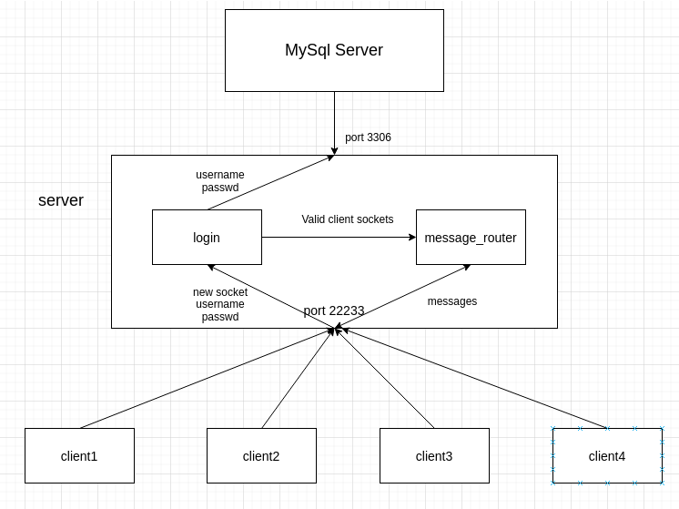

# 0. 前言

​	一. 使用C++开发，运行在linux环境下;

​	二. 服务端需要安装依赖mysql++和jsoncpp;

​	三. 服务端开放22233端口作为监听及通信端口。

​	四. 需要mysql数据库用来保存用户名等基本信息。

# 1. 服务端结构

## 1.1 登陆验证部分

​	以login类的形式存在，负责开放并监听22233端口，与mysql数据库通讯，验证客户端提供的用户名密码的正确性，定期清理超时不发送数据的客户端及验证失败次数过多的客户端，分两个线程，监听线程及定期清理线程。

​	

## 1.2 消息转发部分

​	以message_router类的形式存在，负责接受客户端的聊天信息，并将聊天信息转发到对应的客户端。

​	message_router共有三个线程：

​		message_worker负责接收客户端发来的信息，简单处理后放入消息队列中;

​		message_consumer负责从消息队列中取出消息，根据消息的类型对其进行处理（转发或者回应客户端相应请求）;

​		cleaner负责定期清理down掉的客户端	